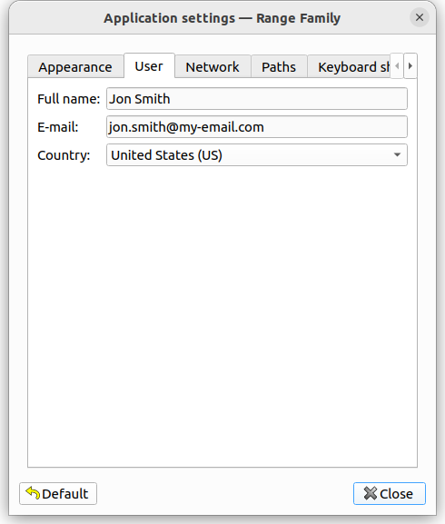
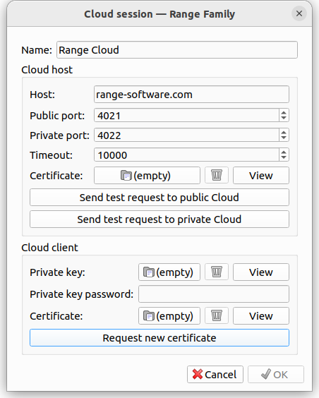
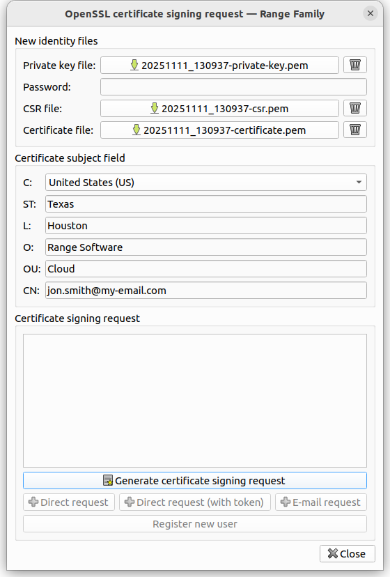
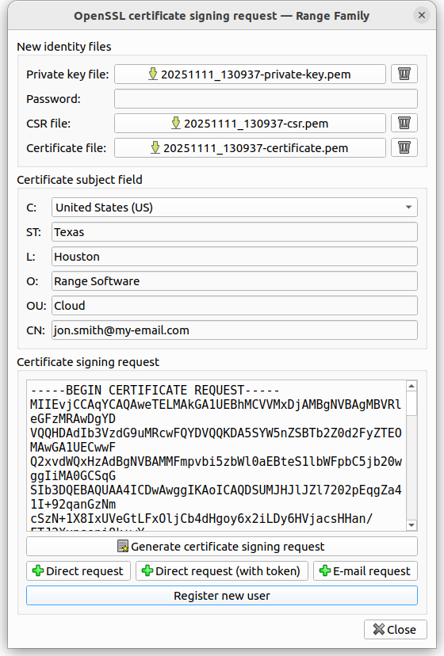
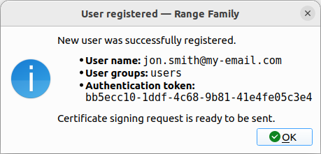
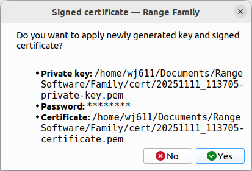
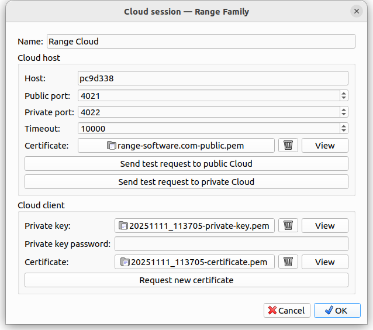

# Cloud - User registration

Registered **Range Cloud** users may authenticate using CA signed client certificate or by using temporary one-time *authentication token*. This guide will demonstrate how to register new user on **Range Cloud**. The whole registration process consists of following steps:
1. Creation of new *user account*
2. Generation of temporary one-time *authentication token*
3. Generation of *Certificate Signing Request (CSR)*
4. Sending *CSR* to **Range Cloud** using newly created *user account* and generated *authentication token*
5. Fetching *CA signed client certificate* from **Range Cloud** and configuring setting it for future usage

By using *Cloud session manager* this whole process is simplified to few clicks.

## 1. Confirm or change user settings

**Menu:** *File -> Application settings*

First make sure that user personal information is set.

## 2. Open Cloud session manager

**Menu:** *Cloud -> Cloud session manager*

Keep all values as they are and click *Request new certificate* button.

## 3. Generate Certificate Signing Request (CSR)

In newly open *OpenSSL certificate signing request* dialog window fill in all missing *Certificate subject fields* and click *Generate certificate signing request* button.

**Note:** *CN field* must contain an email address which will be used as your **Range Cloud** *user name*.

## 4. Register new user

Once *CSR* is generated its content will be shown in previously empty text area. To continue click *Register new user* button which will request to create a new *user name* along with *authentication token* on **Range Cloud**.

Once new *user account* is successfully created a confirmation dialog window will appear containing user details. After clicking *OK* button *CSR* will be send to **Range Cloud**.

## 5. Sign user certificate

After *CSR* is successfully processed and *client certificate* is signed by **Range CA** a dialog window will appear offering to apply newly generated key ans signed certificate. Accept it.

## 6. Accept generated key and signed certificate

*Cloud session manager* dialog window now shows correct *Private key* and *Certificate* file names. Clicking *OK* button will save it for the future use.

