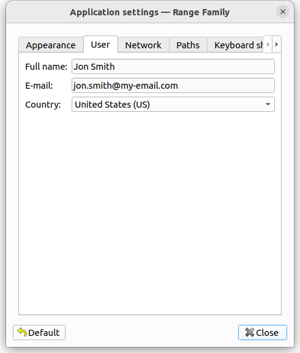
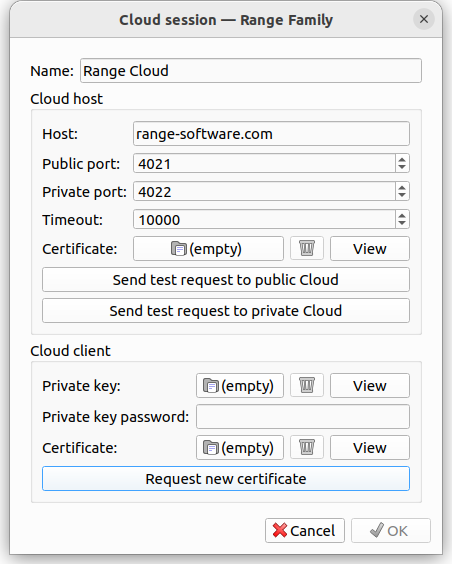
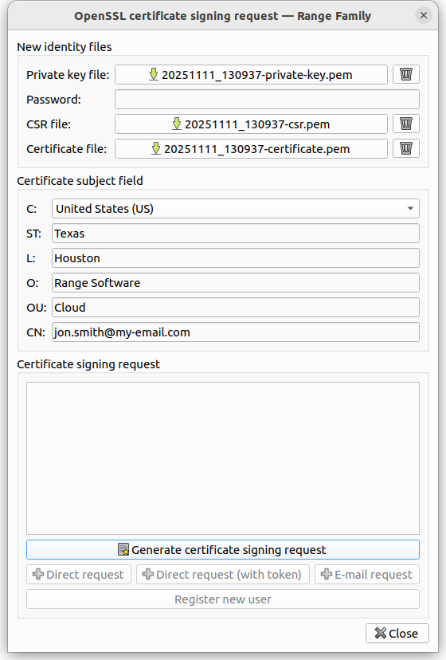
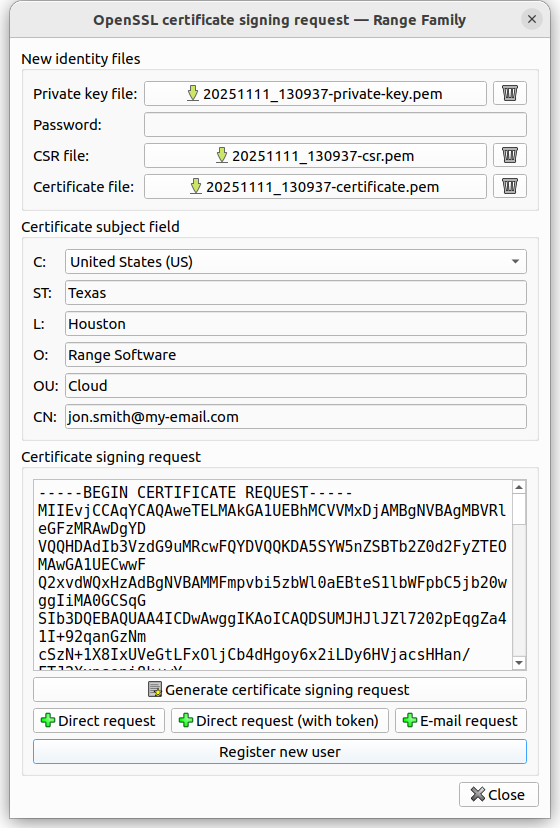
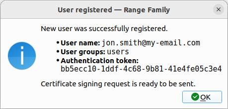
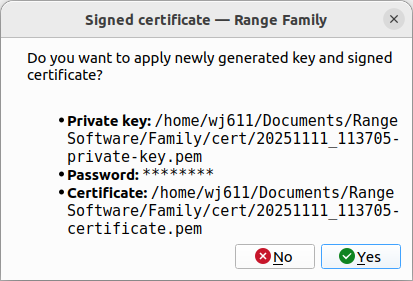
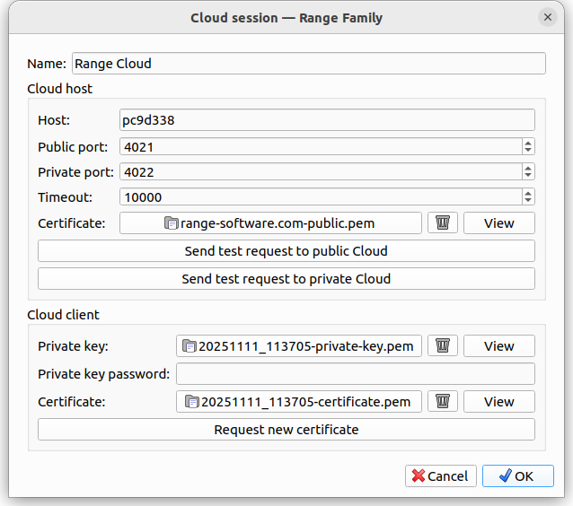

# Cloud - User registration

Registered **Range Cloud** users may authenticate using a CA signed client certificate or by using a temporary one-time *authentication token*. This guide will demonstrate how to register a new user on **Range Cloud**. The whole registration process consists of the following steps:
1. Creation of a new *user account*
2. Generation of a temporary one-time *authentication token*
3. Generation of a *Certificate Signing Request (CSR)*
4. Sending the *CSR* to **Range Cloud** using the newly created *user account* and generated *authentication token*
5. Fetching the *CA signed client certificate* from **Range Cloud** and configuring it for future use

By using *Cloud session manager*, this whole process is simplified to a few clicks.

## 1. Confirm or change user settings

**Menu:** *File -> Application settings*

First, make sure that your personal information is set.

## 2. Open Cloud session manager

**Menu:** *Cloud -> Cloud session manager*

Keep all values as they are and click *Request new certificate* button.

## 3. Generate Certificate Signing Request (CSR)

In the newly opened *OpenSSL certificate signing request* dialog window, fill in all missing *Certificate subject fields* and click the *Generate certificate signing request* button.

**Note:** The *CN field* must contain an email address that will be used as your **Range Cloud** *user name*.

## 4. Register new user

Once the *CSR* is generated, its content will be shown in the previously empty text area. To continue, click the *Register new user* button, which will request to create a new *user name* along with an *authentication token* on **Range Cloud**.

Once a new *user account* is successfully created, a confirmation dialog window will appear containing user details. After clicking the *OK* button, the *CSR* will be sent to **Range Cloud**.

## 5. Sign user certificate

After the *CSR* is successfully processed and the *client certificate* is signed by **Range CA**, a dialog window will appear offering to apply the newly generated key and signed certificate. Accept it.

## 6. Accept generated key and signed certificate

*Cloud session manager* dialog window now shows the correct *Private key* and *Certificate* file names. Clicking the *OK* button will save them for future use.

