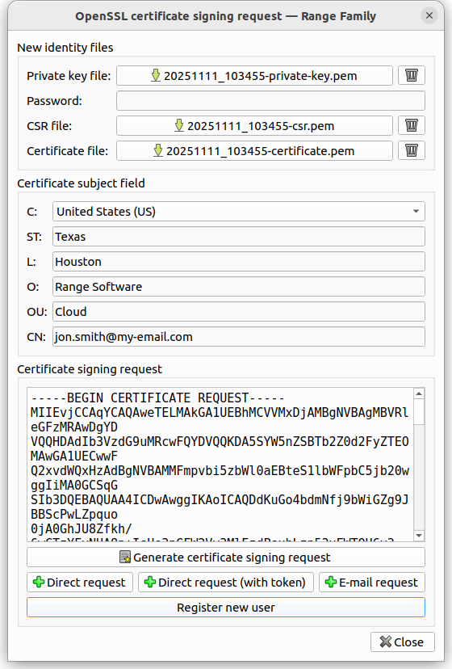

# Cloud user registration

## 1. User settings

**Menu:** _File -> Application settings_

First make sure that user personal information is set.

## 2. Cloud session

**Menu:** _Cloud -> Cloud session manager_

## 3. Certificate Signing Request (CSR)

## 4. Sign user certificate

## 5. Accept generated key and signed certificate

