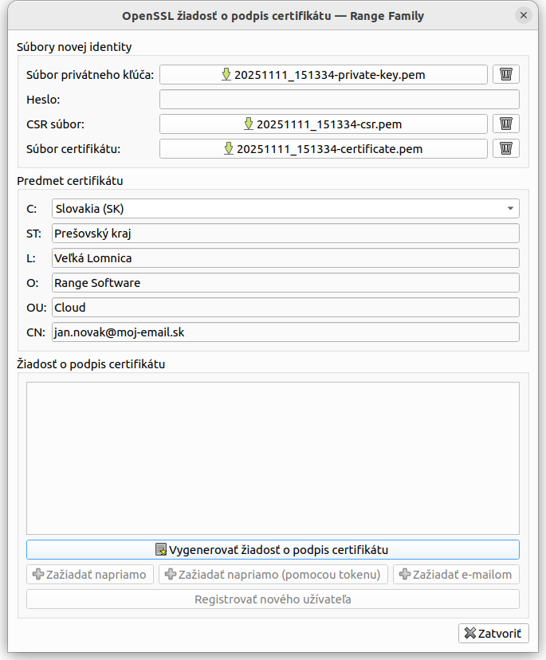
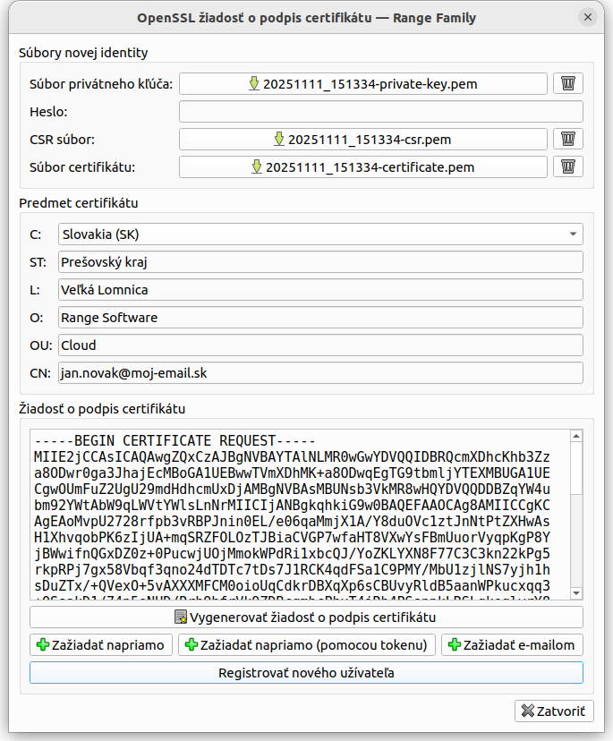
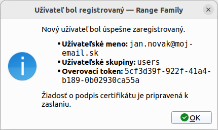
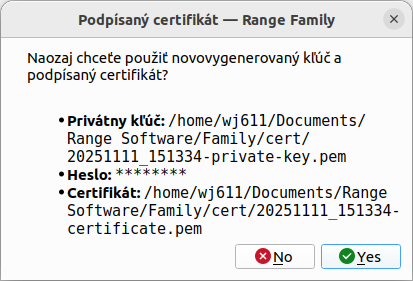
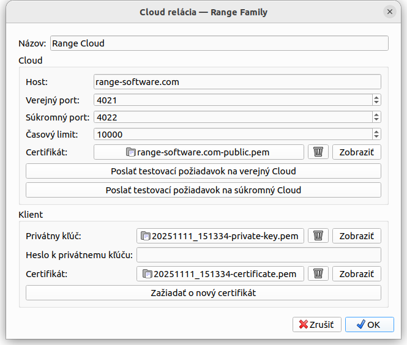

# Cloud - Registrácia užívateľa

Registrovaní používatelia **Range Cloud** sa môžu overovať pomocou klientského certifikátu podpísaného CA alebo pomocou dočasného jednorazového *overovacieho tokenu*. Tento návod ukáže, ako zaregistrovať nového používateľa na **Range Cloud**. Celý registračný proces pozostáva z nasledujúcich krokov:
1. Vytvorenie nového *používateľského účtu*
2. Vygenerovanie dočasného jednorazového *overovacieho tokenu*
3. Vygenerovanie *žiadosti o podpis certifikátu (CSR)*
4. Odoslanie *CSR* na **Range Cloud** pomocou novovytvoreného *používateľského účtu* a vygenerovaného *overovacieho tokenu*
5. Stiahnutie *klientského certifikátu podpísaného CA* z **Range Cloud** a jeho nastavenie pre budúce použitie

Pomocou *správcu cloudových relácií* je celý tento proces zjednodušený na niekoľko kliknutí.

## 1. Potvrďte alebo zmeňte nastavenia používateľa

**Menu:** *Súbor -> Nastavenia aplikácie*

Najprv sa uistite, že vaše osobné informácie sú vyplnené.

## 2. Otvorte správcu cloudových relácií

**Menu:** *Cloud -> Správca cloudových relácií*

Ponechajte všetky hodnoty tak, ako sú, a kliknite na tlačidlo *Požiadať o nový certifikát*.

## 3. Vygenerujte žiadosť o podpis certifikátu (CSR)

V novo otvorenom dialógovom okne *žiadosti o podpis certifikátu OpenSSL* vyplňte všetky chýbajúce *polia predmetu certifikátu* a kliknite na tlačidlo *Vygenerovať žiadosť o podpis certifikátu*.

**Poznámka:** Pole *CN* musí obsahovať e-mailovú adresu, ktorá bude použitá ako vaše *používateľské meno* na **Range Cloud**.

## 4. Zaregistrujte nového používateľa

Po vygenerovaní *CSR* sa jeho obsah zobrazí v predtým prázdnej textovej oblasti. Pokračujte kliknutím na tlačidlo *Zaregistrovať nového používateľa*, ktoré požiada o vytvorenie nového *používateľského mena* spolu s *overovacím tokenom* na **Range Cloud**.

Po úspešnom vytvorení nového *používateľského účtu* sa zobrazí potvrdzujúce dialógové okno s údajmi používateľa. Po kliknutí na tlačidlo *OK* bude *CSR* odoslaný na **Range Cloud**.

## 5. Podpíšte používateľský certifikát

Po úspešnom spracovaní *CSR* a podpísaní *klientského certifikátu* certifikačnou autoritou **Range CA** sa zobrazí dialógové okno ponúkajúce možnosť použiť novovygenerovaný kľúč a podpísaný certifikát. Prijmite ho.

## 6. Prijmite vygenerovaný kľúč a podpísaný certifikát

Dialógové okno *správcu cloudových relácií* teraz zobrazuje správne názvy súborov *súkromného kľúča* a *certifikátu*. Kliknutím na tlačidlo *OK* ich uložíte pre budúce použitie.

